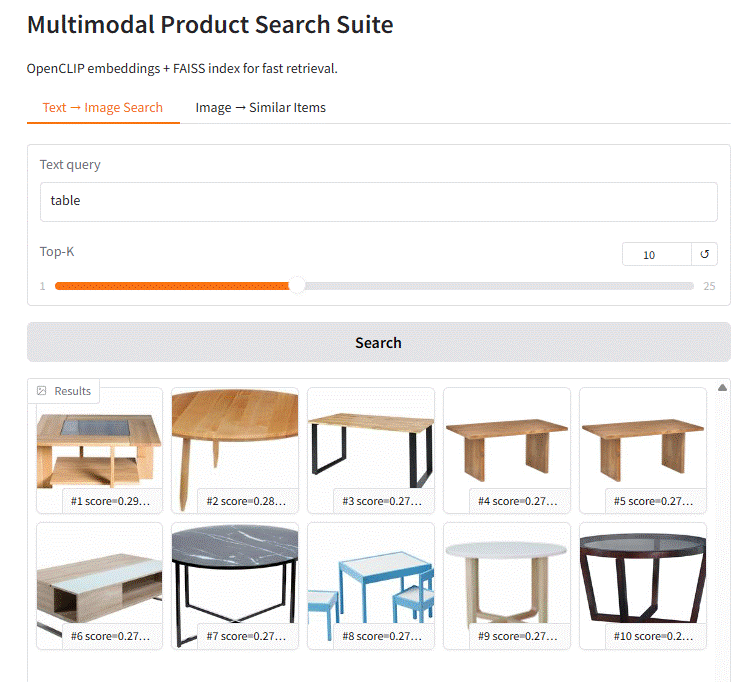
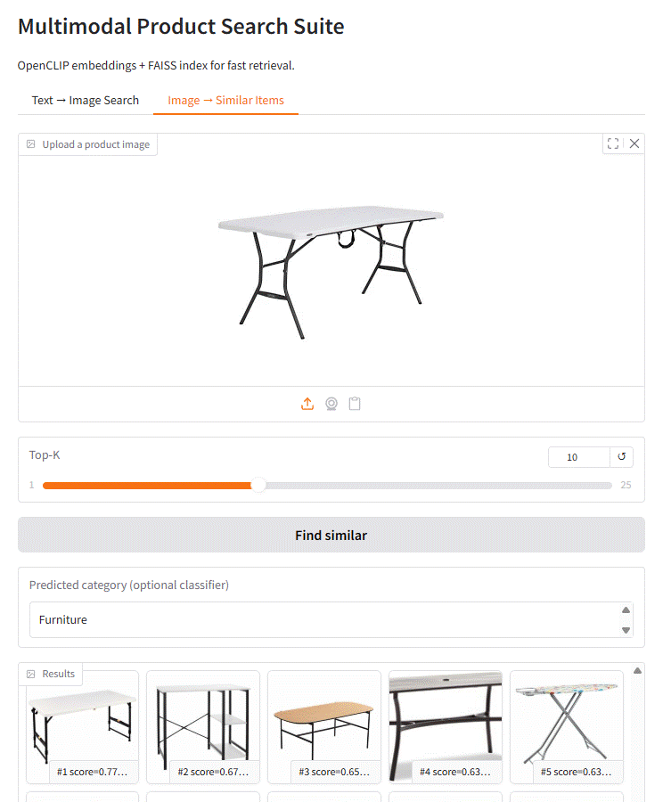
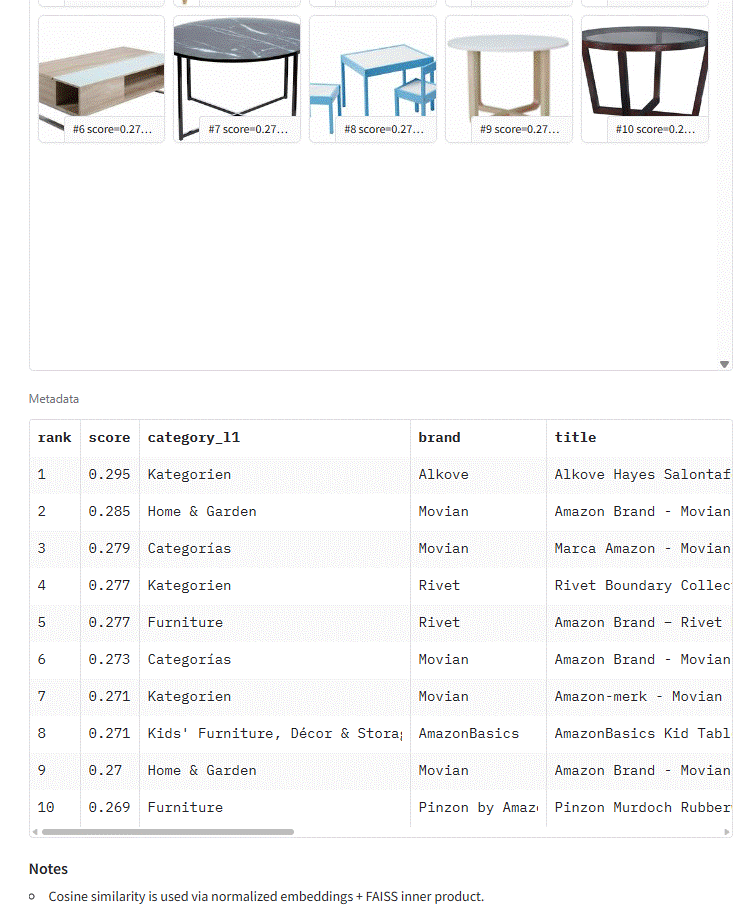
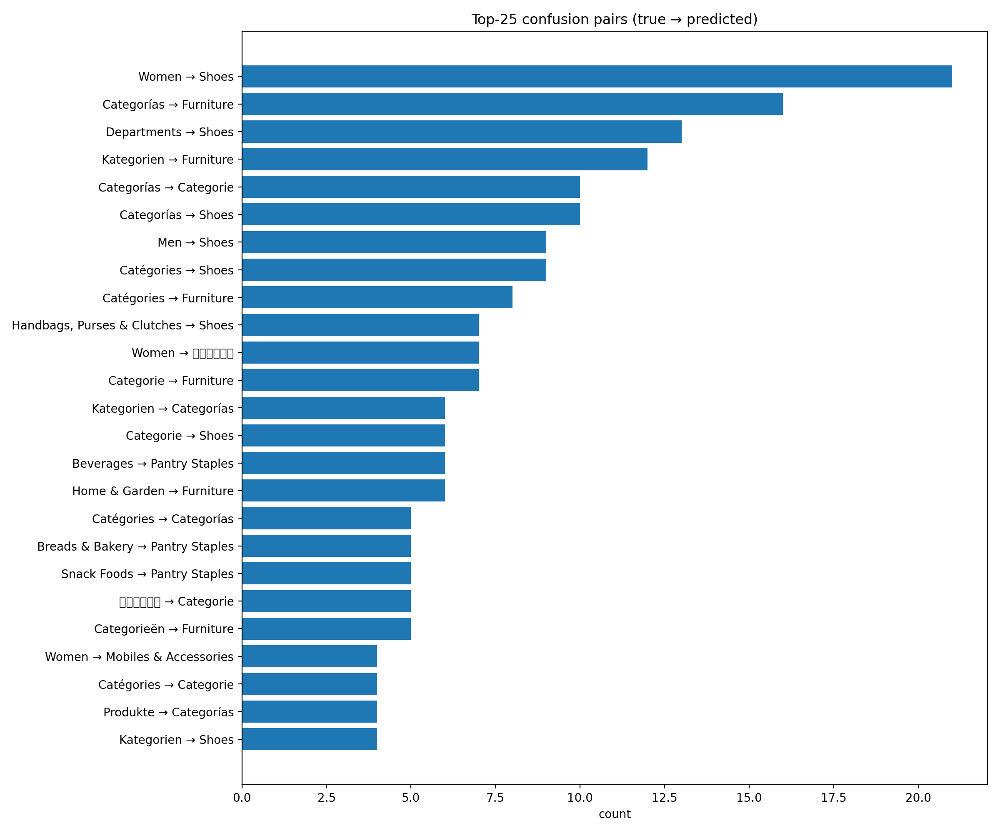

# Multimodal Product Search Suite (OpenCLIP + FAISS)

**Multimodal Retrieval** project for e-commerce product search:

- **Text → Image search**: type a query (e.g., “table”) → retrieve relevant product images
- **Image → Similar items**: upload an image → retrieve visually similar products
- **Optional image category prediction**: a lightweight **linear classifier head** on top of frozen CLIP image embeddings

This uses **OpenCLIP (ViT-B-32)** for embeddings, and **FAISS** for fast nearest-neighbor search on the image embedding index.

---

## What “multimodal retrieval” means (in 30 seconds)

OpenCLIP maps **text** and **images** into the **same vector space**.  
At query time we:

1. **Embed** the query (text or image) → vector `q`
2. **Normalize** it (L2)
3. Use FAISS to find the **Top‑K nearest vectors** in the image index using **inner product**
   - With normalized vectors: **inner product ≡ cosine similarity**

---

## Project phases (what you can talk about in interviews)

### Phase 0 — Baseline (no training, “zero-shot”)

Evaluate the pretrained OpenCLIP model as-is on your domain (ABO-mini).  
This is often called **zero-shot retrieval** (you’re not training, just evaluating the pretrained model).

### Phase 1 — Fine-tune for retrieval (contrastive)

Fine-tune the model with a **CLIP-style contrastive loss** to better align **your domain text** (product titles/attributes) with **your domain images** (catalog photos).

### Phase 2 — Build a FAISS index

Embed all candidate images and build a FAISS index for fast ANN search.

### Phase 3 — Train an image classifier head (optional)

Freeze the CLIP backbone and train a **linear head** to predict `category_l1` from the **image embedding**.

---

## Results (Baseline vs Fine-tuned Retrieval)

Metrics:

- **Recall@K**: % of queries where the correct match is in the Top‑K results
- **MRR**: rewards ranking the correct match higher (1 / rank)

### Validation (n=1038)

| Direction    |                   Setting |     R@1 |     R@5 |    R@10 |     MRR |
| ------------ | ------------------------: | ------: | ------: | ------: | ------: |
| Text → Image |     Baseline (pretrained) |  0.5829 |  0.8314 |  0.8882 |  0.6961 |
| Text → Image |  Fine-tuned (contrastive) |  0.6686 |  0.9066 |  0.9480 |  0.7781 |
| Text → Image | Δ (fine-tuned − baseline) | +0.0857 | +0.0751 | +0.0597 | +0.0821 |
| Image → Text |     Baseline (pretrained) |  0.6618 |  0.8767 |  0.9220 |  0.7582 |
| Image → Text |  Fine-tuned (contrastive) |  0.6994 |  0.9239 |  0.9605 |  0.7990 |
| Image → Text | Δ (fine-tuned − baseline) | +0.0376 | +0.0472 | +0.0385 | +0.0408 |

### Test (n=1040)

| Direction    |                   Setting |     R@1 |     R@5 |    R@10 |     MRR |
| ------------ | ------------------------: | ------: | ------: | ------: | ------: |
| Text → Image |     Baseline (pretrained) |  0.5885 |  0.8279 |  0.8846 |  0.7001 |
| Text → Image |  Fine-tuned (contrastive) |  0.6904 |  0.9154 |  0.9490 |  0.7958 |
| Text → Image | Δ (fine-tuned − baseline) | +0.1019 | +0.0875 | +0.0644 | +0.0957 |
| Image → Text |     Baseline (pretrained) |  0.6731 |  0.8962 |  0.9317 |  0.7704 |
| Image → Text |  Fine-tuned (contrastive) |  0.7125 |  0.9288 |  0.9548 |  0.8097 |
| Image → Text | Δ (fine-tuned − baseline) | +0.0394 | +0.0327 | +0.0231 | +0.0393 |

### Interpretation (why Text→Image improved more)

Pretrained CLIP is trained mostly on **web image–caption pairs**. Your dataset uses **product titles + structured attributes** (“brand”, “material”, “node*path”…), which look different from web captions.  
Contrastive fine-tuning teaches the text encoder that \_your style of text* should land near the correct product images—so **Text→Image gets a bigger boost** than Image→Text in many e-commerce settings.

---

## Optional Classification results (image → category)

The classifier is trained on **frozen CLIP image embeddings** (no CLIP fine-tuning).  
Example from my run (ABO-mini):

- Top‑1 ≈ **0.61**
- Top‑3 ≈ **0.71**
- Top‑5 ≈ **0.79**
- Macro‑F1 ≈ **0.04** (low is common with many imbalanced classes)

---

## Demo

### Text → Image retrieval (OpenCLIP embeddings + FAISS)



### Image → Similar items (+ optional category prediction)



---

### Qualitative results

**Query:** `table`  
The model returns visually consistent “table” items ranked by cosine-similarity in the FAISS space.



**Image → Similar items**  
Top-K visually similar products from the same embedding space


## Dataset label distribution


## Top confusions (validation)



Per-class metrics (generated): `artifacts/abo/classifier/per_class_f1.csv`

---

## Quickstart

### 1) Install

```bash
pip install -r requirements.txt
```

### 2) Prepare ABO-mini parquet splits

```bash
python -m src.data.prepare_abo --config configs/abo_prepare.yaml
```

### 3) Phase 0: Baseline evaluation (pretrained weights)

```bash
python -m src.eval.eval_retrieval   --config configs/abo_retrieval_baseline.yaml   --parquet data/processed/abo_mini/val.parquet   --max_eval -1   --batch_size 256   --k 1,5,10   --save_json artifacts/abo/retrieval/metrics_val_baseline.json

python -m src.eval.eval_retrieval   --config configs/abo_retrieval_baseline.yaml   --parquet data/processed/abo_mini/test.parquet   --max_eval -1   --batch_size 256   --k 1,5,10   --save_json artifacts/abo/retrieval/metrics_test_baseline.json
```

### 4) Phase 1: Fine-tune retrieval (contrastive)

```bash
python -m src.train.train_retrieval --config configs/abo_retrieval.yaml
```

Evaluate fine-tuned weights:

```bash
python -m src.eval.eval_retrieval   --config configs/abo_retrieval.yaml   --parquet data/processed/abo_mini/val.parquet   --max_eval -1   --batch_size 256   --k 1,5,10   --save_json artifacts/abo/retrieval/metrics_val.json

python -m src.eval.eval_retrieval   --config configs/abo_retrieval.yaml   --parquet data/processed/abo_mini/test.parquet   --max_eval -1   --batch_size 256   --k 1,5,10   --save_json artifacts/abo/retrieval/metrics_test.json
```

### 5) Build a FAISS index (image embeddings)

```bash
python -m src.eval.build_faiss_index   --config configs/abo_retrieval.yaml   --parquet data/processed/abo_mini/test.parquet   --out_dir artifacts/abo/faiss   --max_items -1   --batch_size 256   --save_embeddings
```

### 6) Train the classifier head (optional)

```bash
python -m src.train.train_classifier --config configs/abo_classifier.yaml
```

### 7) Launch the Gradio demo

```bash
python -m src.app.gradio_app   --retrieval_cfg configs/abo_retrieval.yaml   --faiss_dir artifacts/abo/faiss   --clf_ckpt artifacts/abo/classifier/openclip_abo_classifier_best.pt   --device cuda   --share
```

**Where is classification in the UI?**  
It appears in the **Image → Similar items** tab as “Predicted category”, _only if_ you pass `--clf_ckpt`.

---

## Artifacts you should include in your GitHub repo

After running the full pipeline, you’ll have:

- Retrieval checkpoint: `artifacts/abo/retrieval/openclip_abo_retrieval.pt`
- Retrieval metrics JSON: `artifacts/abo/retrieval/metrics_*.json`
- FAISS index + metadata:
  - `artifacts/abo/faiss/abo_images.index`
  - `artifacts/abo/faiss/abo_meta.parquet`
  - (optional) `artifacts/abo/faiss/abo_image_embs.npy`
- Classifier checkpoints: `artifacts/abo/classifier/openclip_abo_classifier_*`

For the README, also capture:

- A **GIF/screenshot** of the Gradio demo
- The **results tables** (above) and a short interpretation

---

## Project structure (example)

To print a tree in terminal:

```bash
# install if needed
sudo apt-get update && sudo apt-get install -y tree

tree -L 4
```

---

## Notes / Next upgrades

- Scale to 100k+ items (consider FAISS IVF/PQ for memory/speed trade-offs)
- Add reranking (cross-encoder) for higher precision on the top‑K
- Improve the classifier head (small MLP, class weighting, focal loss)
- Add experiment tracking (MLflow/W&B) and a Dockerized inference API

---

## Class imbalance (why Macro-F1 matters)

Product taxonomies are typically **long-tailed**: a few categories have many examples, while many categories have very few.
Because of that:

- **Top-K accuracy** (Top-1/3/5) tells you whether the correct class is “in the shortlist” (useful for UX).
- **Macro-F1** averages F1 _per class_ and treats rare classes equally — it is a better signal when classes are imbalanced.

### Techniques to handle imbalance (what I would add next)

**1) Class-weighted cross-entropy (easy + strong baseline)**  
Weight classes inversely by frequency so rare classes are not ignored.

- Weight options: `1/freq`, `1/sqrt(freq)`, or “effective number of samples”.

**2) Focal Loss (good when many easy negatives dominate)**  
Down-weights easy examples and focuses learning on hard / rare cases.

**3) Balanced sampling / WeightedRandomSampler**  
Over-sample rare classes or build “balanced batches” so every batch sees a healthier label mix.

**4) Label smoothing + stronger augmentations**
Helps stability + reduces overconfidence (often boosts Top-K in long-tail settings).

**5) Better reporting**
Add a confusion matrix + per-class F1 table for the head classes and a “tail bucket” summary.

---

## License / Dataset

Amazon Berkeley Objects dataset is provided under CC BY 4.0 (see dataset license file in `data/raw/abo/`).
